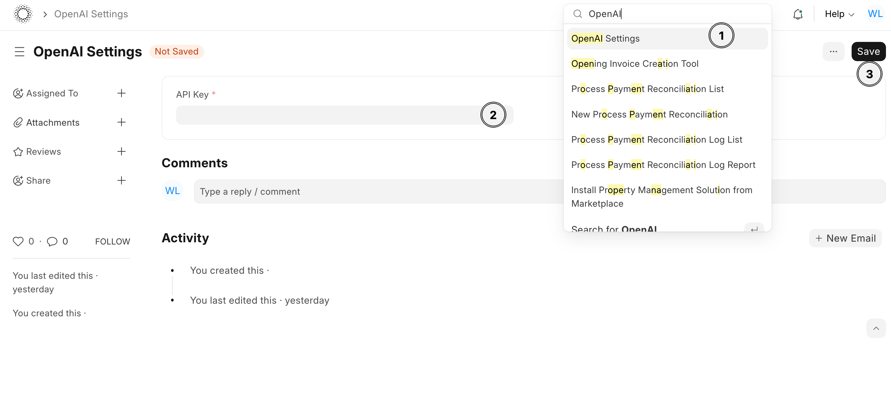
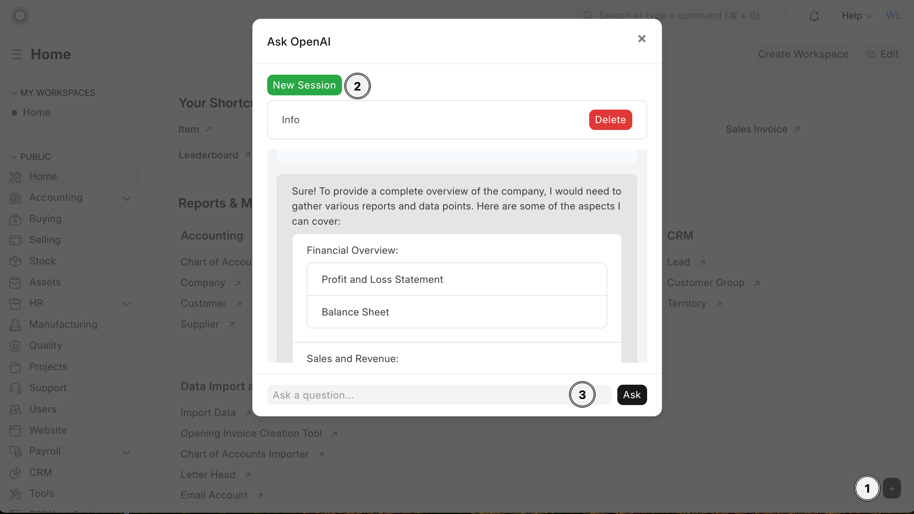

# ERPNext OpenAI Integration

Welcome to the ERPNext OpenAI Integration app. This app allows you to integrate OpenAI functionality with your ERPNext system, enabling advanced AI-powered capabilities.

## Features

- Seamless integration with ERPNext.
- Use OpenAI to generate responses to user queries.
- Execute ERPNext-specific functions through AI prompts.
- Enhance your ERPNext system with AI-driven insights and automation.

## Prerequisites

- ERPNext installed and configured.
- An OpenAI API key.

## Installation

1. Clone the repository:
   ```bash
   git clone https://github.com/williamluke4/erpnext_chatgpt.git
   ```

2. Navigate to the app directory and install dependencies:
   ```bash
   cd erpnext_openai_integration
   bench get-app erpnext_chatgpt .
   ```

3. Install the app on your ERPNext site:
   ```bash
   bench --site [your-site-name] install-app erpnext_chatgpt
   ```

## Setup

### Create OpenAI API Key

1. Go to the [OpenAI API Keys page](https://platform.openai.com/api-keys) and create a new API key.
   
### Set OpenAI API Key

1. Log in to your ERPNext instance.
2. Navigate to **OpenAI Settings**.
3. Enter your API key in the **API Key** field and save.



## Usage

### Ask OpenAI
**Note**: The button will only show if you are a system manager and the api key is valid.

1. Click the **OpenAI Chat** button.
2. Create a Session
3. Ask your question in the input field and click **Ask**.
4. The AI-generated response will appear in the response area.



### Available Functions

You can use the following functions with the OpenAI integration:

- **get_sales_invoices**: Get sales invoices from a specified date range.
- **get_sales_invoice**: Get a specific sales invoice by its number.
- **get_employees**: Retrieve a list of employees, optionally filtered by department and designation.
- **get_purchase_orders**: Get purchase orders from a specified date range, optionally filtered by supplier.
- **get_customers**: Get a list of customers, optionally filtered by customer group.
- **get_stock_levels**: Get current stock levels, optionally filtered by item code.
- **get_general_ledger_entries**: Get general ledger entries from a specified date range, optionally filtered by account.
- **get_balance_sheet**: Get the balance sheet report for a specified date range.
- **get_profit_and_loss_statement**: Get the profit and loss statement report for a specified date range.
- **get_outstanding_invoices**: Get the list of outstanding invoices, optionally filtered by customer.
- **get_sales_orders**: Get sales orders from a specified date range, optionally filtered by customer.
- **get_purchase_invoices**: Get purchase invoices from a specified date range, optionally filtered by supplier.
- **get_journal_entries**: Get journal entries from a specified date range.
- **get_payments**: Get payment entries from a specified date range, optionally filtered by payment type.

## Support

If you encounter any issues or have any questions, please create an issue on our [GitHub repository](https://github.com/your-repo/erpnext_openai_integration/issues).

